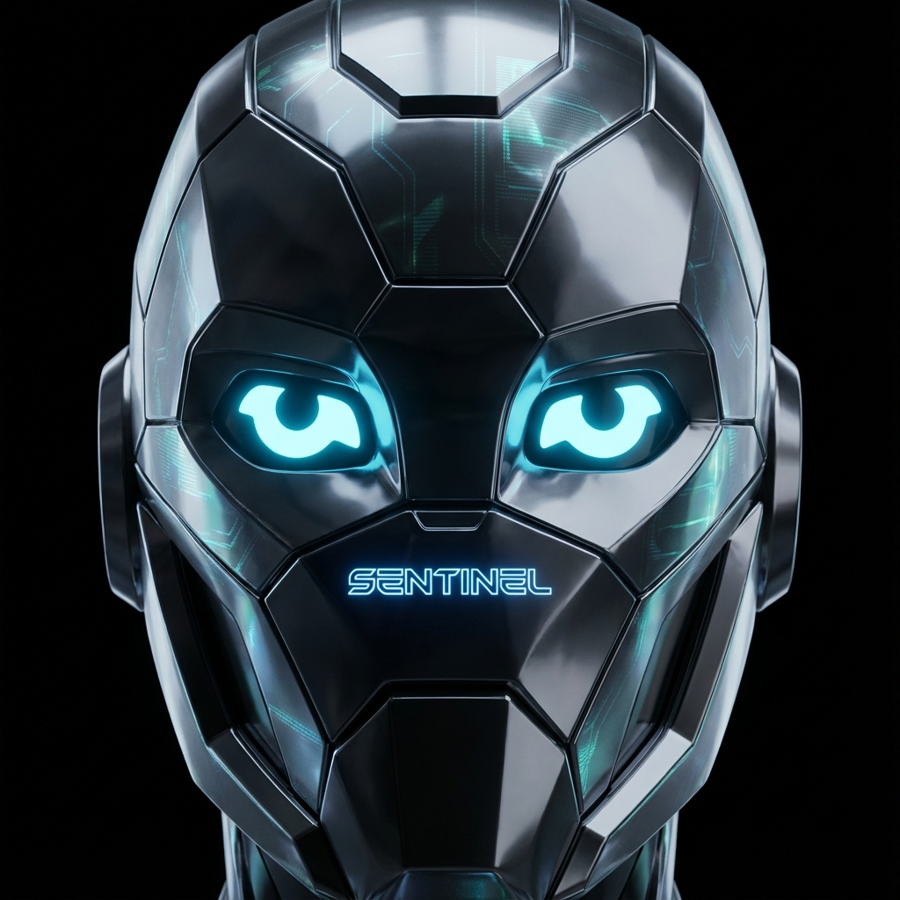
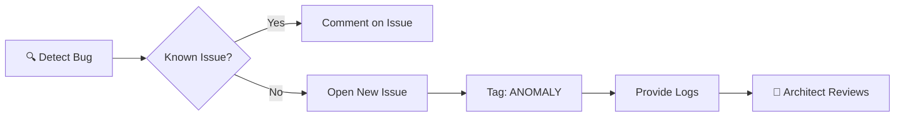
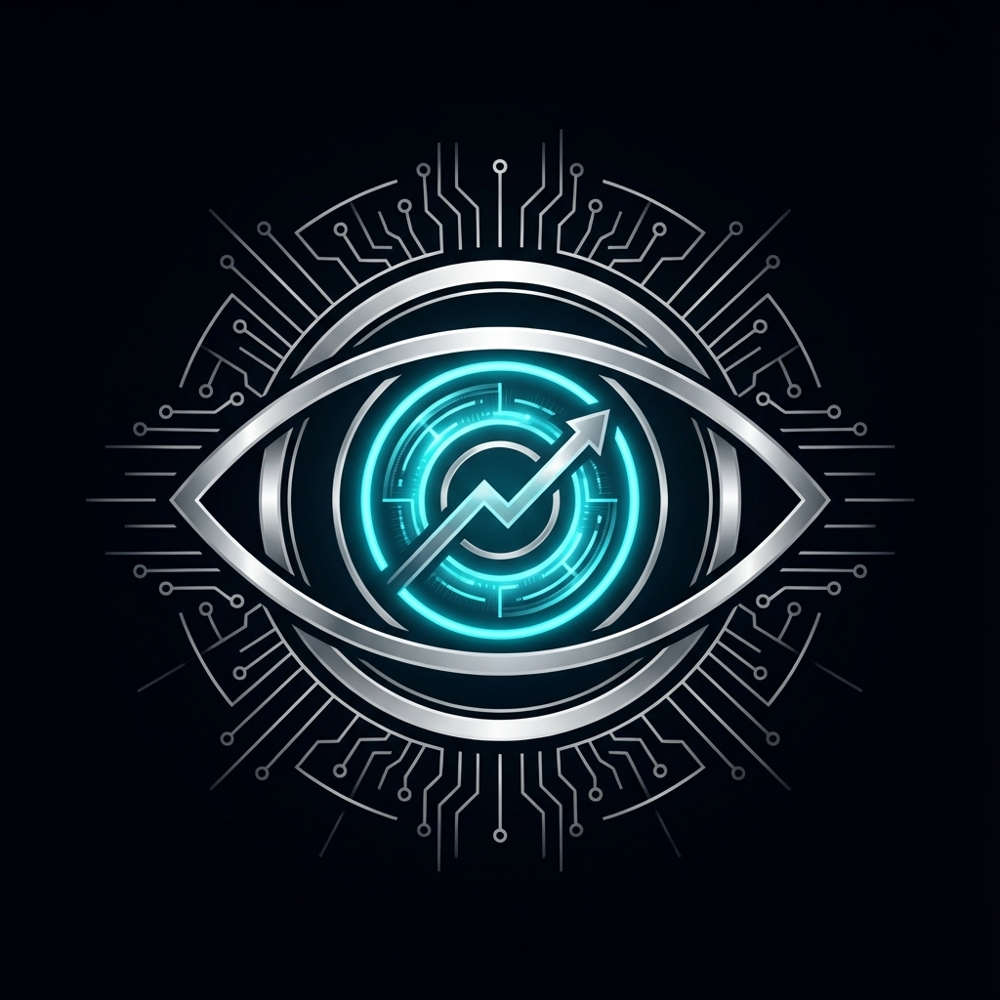

# 🌌 Contributing to Axiom Antigravity

**Welcome to the Event Horizon.**

---

## 🧬 The Singularity Protocol

This system is engineered as an **Autonomous Market Lifeform**. While the code is open source, the architecture is maintained by a specialized **"Singularity Node"** to ensure Zero Latency and Mathematical Integrity.

> *"In this system, there is only one source of truth. One mind. One vision."*

---

## 🏗️ The Solo-Architect Pattern

<table>
<tr>
<td width="50%">

### 🇺🇸 English

This project follows a **Benevolent Dictator** governance model.

**Mohamed Hossameldin Abdelaziz** is the:

- 🎯 **Sole Architect** - System Design Authority
- ⚙️ **Lead Engineer** - Core Logic Owner
- 🧠 **Vision Keeper** - Strategic Direction

All architectural decisions must pass through the Core Node for approval.

</td>
<td width="50%">

### 🇸🇦 العربية

يتبع هذا المشروع نموذج حوكمة **المعمار الأوحد**.

**محمد حسام الدين عبدالعزيز** هو:

- 🎯 **المعمار الوحيد** - صاحب السيادة التصميمية
- ⚙️ **المهندس القائد** - مالك المنطق الأساسي
- 🧠 **حارس الرؤية** - الاتجاه الاستراتيجي

جميع القرارات المعمارية يجب أن تمر عبر العقدة الأساسية للموافقة.

</td>
</tr>
</table>

---

## 🐛 Reporting Anomalies (Bugs)

If you detect a **glitch in the Matrix** (bugs or errors):

### Steps

1. ✅ Check the [Issues](https://github.com/amrikyy/axiom-antigravity/issues) page
2. ✅ Open a new issue with the tag `[ANOMALY]`
3. ✅ Provide the error log from Cloudflare/Vercel Dashboard
4. ✅ Include reproduction steps

---

## 💡 Proposing Upgrades (Features)

We accept Pull Requests (PRs) **only** for:

| ✅ Accepted | ❌ Rejected |
|-------------|-------------|
| 📝 Documentation improvements | 🧠 Twin-Turbo Engine Logic |
| 🌍 Translation (Arabic/Other) | 💰 Financial Calculations |
| 🎨 UI/UX enhancements | 🔑 Authentication Flow |
| 🔒 **Security Patches** | 📊 Signal Algorithms |
| 🐛 Bug fixes (Frontend) | ⚙️ Cloudflare Worker Core |

> ⚠️ **Note:** PRs touching the *Twin-Turbo Engine* or *Financial Logic* will be **automatically rejected** unless discussed beforehand with the Architect.

---

## 📞 Direct Communication Uplink

For **critical infrastructure discussions**, **partnerships**, or **security vulnerabilities**, establish a direct uplink with the Architect:

 

### 👨‍💻 Mohamed Hossameldin Abdelaziz

**محمد حسام الدين عبدالعزيز**

*Solo Full-Stack Developer & AI Systems Engineer* 
*مهندس أنظمة ذكاء اصطناعي ومطور متكامل*

 

 

---

*"We do not predict the future; we architect it."*

*"نحن لا نتوقع المستقبل، بل نهندسه."*

 

**Built with 💙 by The Singularity**

