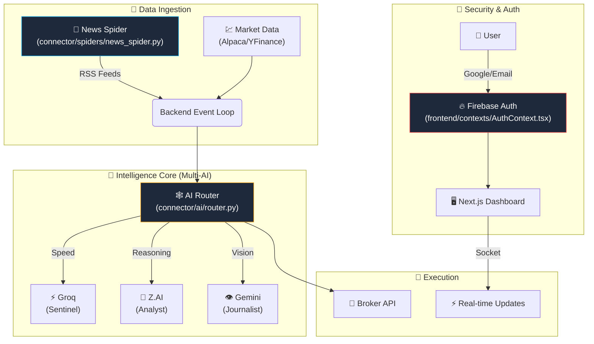

# 🦅 Antigravity Terminal (AQT)

> **Live Dashboard:** [aqt.axiomid.app](https://aqt.axiomid.app)  
> **MCP Server:** [oracle.axiomid.app](https://oracle.axiomid.app/sse)  
> **Telegram Bot:** [@AlphaAxiomBot](https://t.me/AlphaAxiomBot)

An advanced, zero-cost trading terminal leveraging Multi-Model AI Agents, Real-time News Spiders, and Edge Computing.

---

## 🏗️ Architecture



## 📂 Key Directory Structure

```bash
Trading.System-0.1/
├── backend/                  # FastAPI & Python Logic
│   ├── app/                  # Main Application logic
│   └── requirements.txt      # Python Dependencies
├── connector/                # External Integrations
│   ├── ai/                   # 🧠 Multi-AI Router Logic
│   │   ├── router.py         # Main Router Class
│   │   └── providers/        # Groq, Z.AI, Gemini implementations
│   └── spiders/              # 🕷️ News Spiders
│       └── news_spider.py    # RSS Fetcher (Coindesk/Cointelegraph)
├── frontend/                 # Next.js 16 Dashboard
│   ├── app/                  # App Router Pages
│   ├── components/           # UI Components (Shadcn/Recharts)
│   ├── contexts/             # Global State
│   │   └── AuthContext.tsx   # Firebase Authentication Logic
│   └── lib/
│       └── firebase.ts       # Firebase Configuration
└── trading-cloud-brain/      # Cloudflare Worker Logic (Edge)
```

## 🧠 Multi-AI Router

Located in: `connector/ai/router.py`

The system utilizes a specialized **Mixture of Experts (MoE)** routing logic:

- **Sentinel Agent:** Uses **Groq (Llama 3 70B)** for sub-second, high-speed decision making.
- **Analyst Agent:** Uses **Z.AI (GLM-4.6)** for deep reasoning and complex market logic.
- **Journalist Agent:** Uses **Gemini 2.0** for multimodal understanding and narrative generation.
- **Fallback:** Automatically routes to **OpenRouter** if primary providers fail.

## 🔐 Authentication

Located in: `frontend/contexts/AuthContext.tsx`

Secured via **Firebase Authentication**:

- **Google Sign-In:** Implemented via `signInWithPopup`.
- **Email/Password:** Supported via `signInWithEmailAndPassword`.
- **Phone Auth:** (UI Scaffolding present, logic pending).

## 🕷️ Real-time Intelligence

Located in: `connector/spiders/news_spider.py`

- **News Spider:** An async-based spider that monitors RSS feeds from major crypto news outlets (Coindesk, Cointelegraph) every 60 seconds.
- **Zero-Dependency:** Built using pure Python `aiohttp` and `xml.etree` for maximum performance and minimal footprint.

## 🛠️ Tech Stack

### Backend

- **Framework:** FastAPI (`fastapi`, `uvicorn`)
- **Real-time:** Websockets (`websockets`)
- **Data:** Pandas (`pandas`), Numpy (`numpy`)
- **Finance:** Alpaca API (`alpaca-trade-api`), YFinance (`yfinance`)
- **Infra:** Google Secret Manager (`google-cloud-secret-manager`)

### Frontend

- **Framework:** Next.js 16 (`next`)
- **UI Context:** React 19 (`react`)
- **Styling:** TailwindCSS (`tailwindcss`), Lucide Icons (`lucide-react`)
- **Auth:** Firebase SDK (`firebase`)
- **Charts:** Recharts (`recharts`)
- **Design System:** "Sentient Glass" (CSS Variables + Framer Motion)

### Intelligence Hub (New)

- **Engine:** Perplexity Sonar (via automated cron)
- **Database:** Cloudflare D1 (`news`, `briefings`)
- **UI:** Sentient Glass Dashboard (`/news`)

## 🚀 Setup Guide

### 1. Backend Setup

```bash
cd backend
python3 -m venv .venv
source .venv/bin/activate
pip install -r requirements.txt
python -m uvicorn app.main:app --reload
```

### 2. Frontend Setup

```bash
cd frontend
npm install
npm run dev
```

---
*Generated based on codebase analysis: 2025-12-12*
