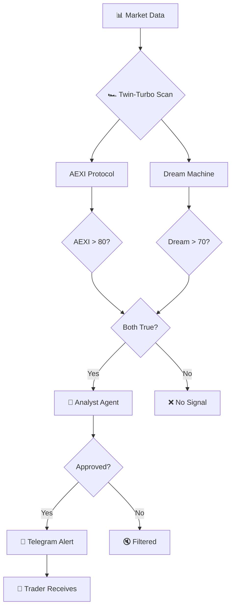

<div align="center">

# 🌌 AXIOM ANTIGRAVITY

### Signal & Analysis Hub | مركز الإشارات والتحليل


**AI-Powered Market Signal Intelligence**
**ذكاء إشارات السوق المدعوم بالذكاء الاصطناعي**

[](https://aitrading.axiomid.app)
[](LICENSE)
[](https://workers.cloudflare.com)
[](https://nextjs.org)

---

*"We don't trade. We provide intelligence."*

*"نحن لا نتداول. نحن نقدم الذكاء."*

</div>

---

## 📖 Table of Contents | جدول المحتويات

<table>
<tr>
<td width="50%">

### 🇺🇸 English
- [What is Axiom?](#-what-is-axiom)
- [How It Works](#-how-it-works)
- [Twin-Turbo Engines](#-twin-turbo-engines)
- [Architecture](#-architecture)
- [Tech Stack](#-tech-stack)
- [Quick Start](#-quick-start)
- [Zero-Cost Infrastructure](#-zero-cost-infrastructure)

</td>
<td width="50%">

### 🇸🇦 العربية
- [ما هو Axiom؟](#-ما-هو-axiom)
- [كيف يعمل النظام؟](#-كيف-يعمل-النظام)
- [محركات Twin-Turbo](#-محركات-twin-turbo)
- [الهيكلية](#-الهيكلية)
- [التقنيات المستخدمة](#-التقنيات-المستخدمة)
- [البدء السريع](#-البدء-السريع)
- [بنية تحتية بتكلفة صفر](#-بنية-تحتية-بتكلفة-صفر)

</td>
</tr>
</table>

---

## 🎯 What is Axiom?

**Axiom Antigravity** is an **AI-powered Signal Hub** that detects market anomalies using advanced mathematical algorithms and validates them through AI agents before alerting traders.

### Key Differentiators

| Feature | Description |
|---------|-------------|
| 🏎️ **AEXI Protocol** | Statistical exhaustion detection using Z-Score, ATR, and Volume Analysis |
| 🌙 **Dream Machine** | Chaos theory metrics including Entropy, Fractal Dimension, and Hurst Exponent |
| 🧠 **Analyst Agent** | Groq-powered AI that validates signals and assigns quality tiers |
| 📰 **AI Journalist** | Gemini Flash generates daily market briefings |
| 📱 **Telegram Alerts** | Instant notifications for high-quality signals |

---

## 🎯 ما هو Axiom؟

**Axiom Antigravity** هو **مركز إشارات مدعوم بالذكاء الاصطناعي** يكتشف الشذوذات في السوق باستخدام خوارزميات رياضية متقدمة ويتحقق منها من خلال وكلاء الذكاء الاصطناعي قبل تنبيه المتداولين.

### المميزات الرئيسية

| الميزة | الوصف |
|--------|-------|
| 🏎️ **بروتوكول AEXI** | اكتشاف الإرهاق الإحصائي باستخدام Z-Score و ATR وتحليل الحجم |
| 🌙 **آلة الأحلام** | مقاييس نظرية الفوضى: الإنتروبيا، البُعد الكسوري، وأس هيرست |
| 🧠 **وكيل المحلل** | ذكاء اصطناعي Groq يتحقق من الإشارات ويعين مستويات الجودة |
| 📰 **الصحفي الآلي** | Gemini Flash ينشئ ملخصات السوق اليومية |
| 📱 **تنبيهات Telegram** | إشعارات فورية للإشارات عالية الجودة |

---

## ⚙️ How It Works

### The Signal Pipeline | خط أنابيب الإشارات



### Step-by-Step Process

1. **Data Collection** — Alpaca API provides real-time market data
2. **Mathematical Scan** — Twin-Turbo engines calculate AEXI and Dream scores
3. **Threshold Check** — Signal triggers when AEXI > 80 AND Dream > 70
4. **AI Validation** — Analyst Agent (Groq) reviews and assigns quality tier
5. **Broadcast** — Approved signals sent to Telegram with full analysis

---

## ⚙️ كيف يعمل النظام؟

### العملية خطوة بخطوة

1. **جمع البيانات** — Alpaca API يوفر بيانات السوق في الوقت الفعلي
2. **المسح الرياضي** — محركات Twin-Turbo تحسب درجات AEXI و Dream
3. **فحص العتبة** — الإشارة تنطلق عندما AEXI > 80 و Dream > 70
4. **التحقق بالذكاء الاصطناعي** — وكيل المحلل (Groq) يراجع ويعين مستوى الجودة
5. **البث** — الإشارات المعتمدة ترسل إلى Telegram مع التحليل الكامل

---

## 🏎️ Twin-Turbo Engines

### AEXI Protocol (Antigravity Extremum Index)

```
AEXI = (0.4 × EXH) + (0.3 × VAF) + (0.3 × SVP)

Where:
┌─────────────────────────────────────────┐
│ EXH = Exhaustion (Z-Score)              │
│       How far price is from mean        │
│       4σ deviation = 100% score         │
├─────────────────────────────────────────┤
│ VAF = Velocity/ATR Factor               │
│       Momentum vs Volatility ratio      │
│       High momentum + low ATR = signal  │
├─────────────────────────────────────────┤
│ SVP = Surveillance Volume Proxy         │
│       Relative volume spike detection   │
│       3x average volume = 100% score    │
└─────────────────────────────────────────┘
```

### Dream Machine (Chaos Theory Engine)

```
DREAM = (0.3 × Entropy) + (0.25 × Fractal) + (0.25 × Hurst) + (0.2 × VolDisp)

Where:
┌─────────────────────────────────────────┐
│ Entropy = Shannon Entropy               │
│           Market disorder measurement   │
│           High = chaos, Low = trend     │
├─────────────────────────────────────────┤
│ Fractal = Fractal Dimension             │
│           Price action "roughness"      │
│           Higuchi's method              │
├─────────────────────────────────────────┤
│ Hurst = Hurst Exponent                  │
│         Memory in price series          │
│         >0.5 trending, <0.5 reverting   │
├─────────────────────────────────────────┤
│ VolDisp = Volume Dispersion             │
│           Variance in trading volume    │
└─────────────────────────────────────────┘
```

---

## 🏎️ محركات Twin-Turbo

### بروتوكول AEXI (مؤشر أقصى مضاد الجاذبية)

| المكون | الوصف |
|--------|-------|
| **EXH** | الإرهاق - كم ابتعد السعر عن المتوسط (Z-Score) |
| **VAF** | عامل السرعة - نسبة الزخم إلى التقلب |
| **SVP** | وكيل حجم المراقبة - اكتشاف ارتفاعات الحجم |

### آلة الأحلام (محرك نظرية الفوضى)

| المكون | الوصف |
|--------|-------|
| **Entropy** | الفوضوية - قياس فوضى السوق |
| **Fractal** | البُعد الكسوري - "خشونة" حركة السعر |
| **Hurst** | أس هيرست - الذاكرة في سلسلة الأسعار |
| **VolDisp** | تشتت الحجم - التباين في حجم التداول |

---

## 🏗️ Architecture

```
┌────────────────────────────────────────────────────────────────┐
│                     AXIOM ANTIGRAVITY                          │
│                   Signal & Analysis Hub                        │
├────────────────────────┬───────────────────────────────────────┤
│                        │                                       │
│   🖥️ FRONTEND          │   ☁️ BACKEND                          │
│   (Next.js 14)         │   (Cloudflare Worker)                 │
│                        │                                       │
│   ┌──────────────────┐ │   ┌─────────────────────────────────┐ │
│   │  📊 Signal Feed  │ │   │  🏎️ Twin-Turbo Engines          │ │
│   │  Live S/A-TIER   │◄──►│  • AEXI Protocol (Pure Python)  │ │
│   │  signals         │ │   │  • Dream Machine (Chaos Math)  │ │
│   └──────────────────┘ │   └─────────────────────────────────┘ │
│                        │                                       │
│   ┌──────────────────┐ │   ┌─────────────────────────────────┐ │
│   │  🏎️ Gauges       │ │   │  🧠 Analyst Agent (Groq)        │ │
│   │  AEXI + Dream    │◄──►│  • Signal Validation            │ │
│   │  live meters     │ │   │  • Quality Grading (S/A/B)     │ │
│   └──────────────────┘ │   │  • Context Generation          │ │
│                        │   └─────────────────────────────────┘ │
│   ┌──────────────────┐ │                                       │
│   │  📰 News Hub     │ │   ┌─────────────────────────────────┐ │
│   │  AI Briefings    │◄──►│  📰 AI Journalist (Gemini)      │ │
│   │  Headlines       │ │   │  • Daily Market Briefings      │ │
│   └──────────────────┘ │   │  • News Summarization          │ │
│                        │   └─────────────────────────────────┘ │
│                        │                                       │
│   ┌──────────────────┐ │   ┌─────────────────────────────────┐ │
│   │  ⚙️ Settings     │ │   │  📱 Telegram Broadcaster        │ │
│   │  Preferences     │ │   │  • Instant Alerts               │ │
│   └──────────────────┘ │   │  • Rich Formatting              │ │
│                        │   └─────────────────────────────────┘ │
├────────────────────────┴───────────────────────────────────────┤
│                        💾 DATA LAYER                           │
│  ┌─────────────┐  ┌──────────────┐  ┌────────────────────────┐ │
│  │ Cloudflare  │  │ Cloudflare   │  │ Alpaca API             │ │
│  │ D1 (SQLite) │  │ KV (Cache)   │  │ (Market Data)          │ │
│  └─────────────┘  └──────────────┘  └────────────────────────┘ │
└────────────────────────────────────────────────────────────────┘
```

---

## 📊 Signal Quality Tiers | مستويات جودة الإشارات

<table>
<tr>
<td width="50%">

### 🇺🇸 English

| Tier | Criteria | Description |
|------|----------|-------------|
| 🏆 **S-TIER** | AEXI > 85 + Dream > 75 + RSI extreme | Highest confidence |
| ⭐ **A-TIER** | AEXI > 80 + Dream > 70 | Strong setups |
| 📊 **B-TIER** | Either AEXI > 80 OR Dream > 70 | Watch list |
| 🔢 **MATH-ONLY** | AI unavailable | Pure math signal |

</td>
<td width="50%">

### 🇸🇦 العربية

| المستوى | المعايير | الوصف |
|---------|----------|-------|
| 🏆 **S-TIER** | AEXI > 85 + Dream > 75 + RSI متطرف | أعلى ثقة |
| ⭐ **A-TIER** | AEXI > 80 + Dream > 70 | إعدادات قوية |
| 📊 **B-TIER** | AEXI > 80 أو Dream > 70 | قائمة المراقبة |
| 🔢 **MATH-ONLY** | الذكاء الاصطناعي غير متاح | إشارة رياضية بحتة |

</td>
</tr>
</table>

---

## 📱 Telegram Alert Example | مثال تنبيه Telegram

```
🚨 ANTIGRAVITY SIGNAL ALERT
━━━━━━━━━━━━━━━━━━━━

📍 Asset: BTC/USD
💰 Price: $68,542.00
📈 Direction: 🟢 BULLISH

━━━━━━━━━━━━━━━━━━━━
🏎️ Twin-Turbo Engines:

AEXI: 88.5/100 (🔥 Critical)
Dream: 74.2/100 (🌙 Chaos Peak)
RSI: 28.5 (🟢 Oversold)
Z-Score: -3.2σ

━━━━━━━━━━━━━━━━━━━━
🧠 Analyst Brief:
"Price extended 4-sigma with chaos
metrics indicating structural break. 
High probability of mean reversion."

🏆 Signal Quality: S-TIER
━━━━━━━━━━━━━━━━━━━━
```

---

## 🛠️ Tech Stack

<table>
<tr>
<td width="50%">

### Frontend
- **Next.js 14** — React framework
- **TypeScript** — Type safety
- **Tailwind CSS** — Styling
- **next-intl** — i18n (EN/AR)
- **Lucide** — Icon system

</td>
<td width="50%">

### Backend
- **Cloudflare Workers** — Edge compute
- **Python** — Worker runtime
- **D1 SQLite** — Database
- **KV Store** — Caching
- **Cron Triggers** — Automation

</td>
</tr>
<tr>
<td width="50%">

### AI Layer
- **Groq** — Analyst Agent (Llama 3.3)
- **Gemini Flash** — AI Journalist
- **Chain-of-Thought** — Reasoning

</td>
<td width="50%">

### Integrations
- **Alpaca API** — Market data
- **Telegram Bot** — Alerts
- **Ably** — Real-time WebSocket

</td>
</tr>
</table>

---

## 🚀 Quick Start

### Frontend

```bash
cd frontend
npm install
npm run dev
# Open http://localhost:3000
```

### Backend

```bash
cd trading-cloud-brain
wrangler dev
# Worker runs on http://localhost:8787
```

### Deploy

```bash
# Frontend to Vercel
cd frontend && npx vercel --prod

# Backend to Cloudflare
cd trading-cloud-brain && wrangler deploy
```

---

## 🚀 البدء السريع

```bash
# تثبيت الواجهة الأمامية
cd frontend
npm install
npm run dev

# تشغيل الخلفية
cd trading-cloud-brain
wrangler dev
```

---

## 💰 Zero-Cost Infrastructure | بنية تحتية بتكلفة صفر

| Service | Usage | Free Tier |
|---------|-------|-----------|
| **Cloudflare Workers** | Backend | 100,000 req/day |
| **Cloudflare D1** | Database | 5M reads/day |
| **Cloudflare KV** | Cache | 100K reads/day |
| **Groq API** | Analyst Agent | 14,400 req/day |
| **Gemini Flash** | AI Journalist | 1,000 req/day |
| **Vercel** | Frontend | Unlimited |
| **Telegram Bot** | Alerts | Unlimited |
| **Alpaca API** | Market Data | Unlimited |

**Total Monthly Cost: $0** 💵

---

## 📁 Project Structure

```
axiom-antigravity/
├── 📄 README.md              ← You are here
├── 📄 LICENSE                ← MIT 2025
├── 📄 CONTRIBUTING.md        ← Contribution guidelines
│
├── 📁 frontend/              ← Next.js 14 App
│   ├── src/
│   │   ├── app/[locale]/     ← Pages (Signal Hub, News, Settings)
│   │   ├── components/       ← React components
│   │   └── i18n/             ← Internationalization
│   ├── messages/             ← EN/AR translations
│   └── public/               ← Brand assets
│
└── 📁 trading-cloud-brain/   ← Cloudflare Worker
    ├── src/worker.py         ← Main API (1900+ lines)
    ├── schema.sql            ← D1 database schema
    └── wrangler.toml         ← Worker configuration
```

---

## 👤 Author | المؤلف

<table>
<tr>
<td>

**Mohamed Hossameldin Abdelaziz**
*Axiom Antigravity Architect*

**محمد حسام الدين عبد العزيز**
*مهندس Axiom Antigravity*

</td>
<td>

- 📧 cryptojoker710@gmail.com
- 🐙 [@Moeabdelaziz007](https://github.com/Moeabdelaziz007)
- 🌐 [axiomid.app](https://axiomid.app)

</td>
</tr>
</table>

---

## 📄 License | الرخصة

MIT License © 2025 Mohamed Hossameldin Abdelaziz

---

<div align="center">

### 🌌 Built with AI + Zero Cost 🌌

**مبني بالذكاء الاصطناعي + تكلفة صفر**

---

*"We don't trade. We provide intelligence."*

*"نحن لا نتداول. نحن نقدم الذكاء."*

</div>