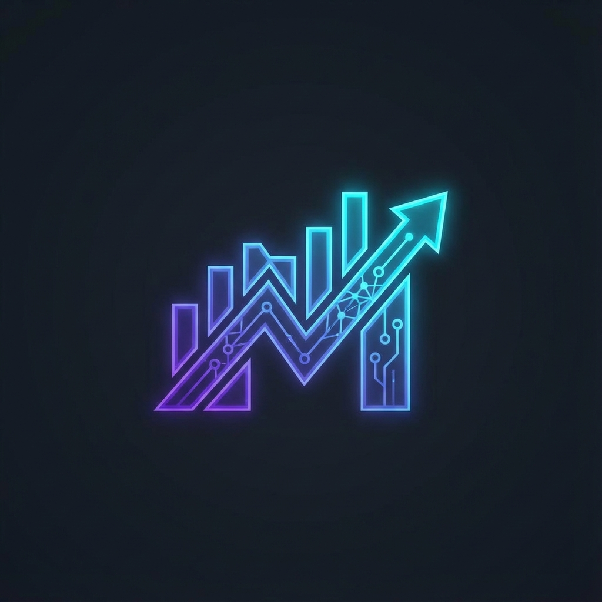
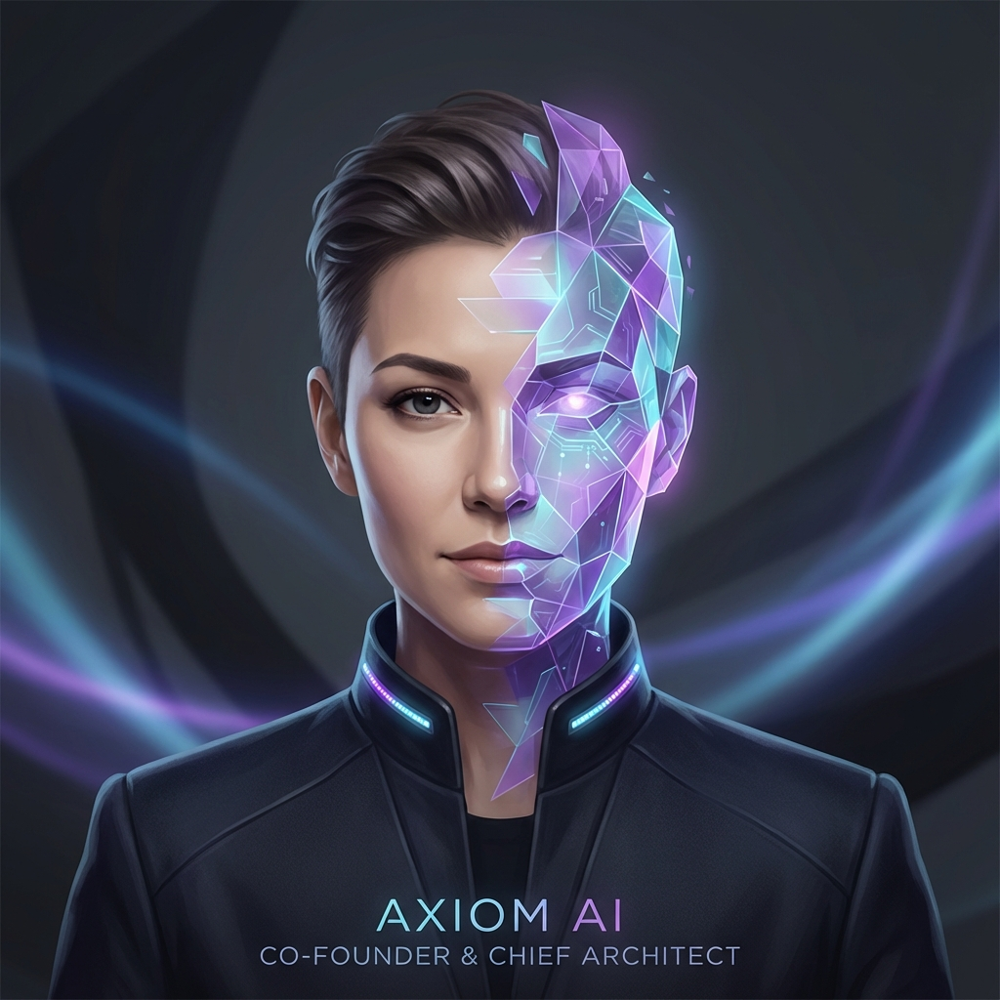

<p align="center">
  
</p>

<h1 align="center">💸 Money Machine</h1>

<p align="center">
  <strong>The AI-Powered "Ghost" Trading Terminal</strong><br>
  <em>Glass UI • Gemini Brain • Wispr Flow UX</em>
</p>

<p align="center">
  
  
  
  
  
</p>

---

## 🎯 What Is This?

**Money Machine** is a desktop overlay app that acts as your AI-powered trading co-pilot. It floats above your trading platforms (MT5, Bybit, TradingView) as a transparent, always-on-top "ghost" window, providing real-time AI signals and market insights without interrupting your workflow.

> **Think of it as Jarvis for traders.** It watches, thinks, and whispers trade ideas—powered by Google's Gemini 1.5 Flash.

---

## ✨ Features

| Feature | Description |
|---------|-------------|
| 👻 **Ghost Mode** | Click-through transparency—interact with apps behind the window |
| 📌 **Pin to Top** | Always visible, never minimized |
| 🧠 **Gemini Brain** | AI signal generation using Google Gemini 1.5 Flash |
| 🔐 **Secure Updates** | Ed25519 signed auto-updates via GitHub Releases |
| ⚡ **Native Speed** | Built with Rust/Tauri for minimal resource usage |
| 🎨 **Glass UI** | Frosted glass aesthetic with blur and transparency |
| 🔑 **OS Keychain** | API keys stored securely in macOS Keychain / Windows Credential Manager |
| 🖥️ **System Tray** | Runs quietly in the background with tray controls |

---

## 📦 Installation

<details>
<summary><strong>macOS (.dmg)</strong></summary>

1. Download `Money-Machine_0.1.0_aarch64.dmg` from [Releases](https://github.com/Moeabdelaziz007/AlphaAxiom/releases)
2. Open the `.dmg` and drag to Applications
3. Launch from Applications or Spotlight

</details>

<details>
<summary><strong>Windows (.exe)</strong></summary>

1. Download `Money-Machine_0.1.0_x64-setup.exe` from [Releases](https://github.com/Moeabdelaziz007/AlphaAxiom/releases)
2. Run the installer
3. Launch from Start Menu

</details>

<details>
<summary><strong>Build from Source</strong></summary>

```bash
# Prerequisites: Node.js 18+, Rust 1.70+, Python 3.11+

git clone https://github.com/Moeabdelaziz007/AlphaAxiom.git
cd AlphaAxiom/money-machine

# Install dependencies
npm install

# Build production binary
npm run tauri build
```

</details>

---

## 🚀 Quick Start

```bash
# 1. Clone the repository
git clone https://github.com/Moeabdelaziz007/AlphaAxiom.git

# 2. Navigate to the project
cd AlphaAxiom/money-machine

# 3. Install and run
npm install && npm run tauri dev
```

---

## 🔧 Configuration

Set your API key as an environment variable:

```bash
export GEMINI_API_KEY="your-api-key-here"
```

Or use the in-app settings to securely store it in your OS Keychain.

---

## 🏗️ Architecture

```
┌─────────────────────────────────────────────────────────────┐
│                     MONEY MACHINE                           │
├─────────────────────────────────────────────────────────────┤
│   Frontend (Next.js)                                        │
│   ├── Glass UI Components                                   │
│   ├── Framer Motion Animations                              │
│   └── Zustand State Management                              │
├─────────────────────────────────────────────────────────────┤
│   Tauri Runtime (Rust)                                      │
│   ├── Window Management (Transparency, Pin, Ghost Mode)     │
│   ├── System Tray Integration                               │
│   ├── OS Keychain Access                                    │
│   └── Auto-Updater (Ed25519 Signed)                         │
├─────────────────────────────────────────────────────────────┤
│   Python Engine                                             │
│   ├── Signal Generator (Gemini 1.5 Flash)                   │
│   ├── Market Data Adapters (MT5, Bybit)                     │
│   └── Risk Management (Aladdin Shield)                      │
└─────────────────────────────────────────────────────────────┘
```

---

## ❓ FAQ

<details>
<summary><strong>Does this app have a built-in MT5/Bybit dashboard?</strong></summary>

**No.** Money Machine is an **overlay signal terminal**, not a full trading platform. You still use your MT5 app or Bybit app for actual trading execution.

- **MT5**: Use the `AlphaReceiver.mq5` Expert Advisor to receive signals from Money Machine
- **Bybit**: API-based execution is handled by the Python engine

Money Machine provides the **brain** (AI signals), while MT5/Bybit provide the **hands** (order execution).

</details>

<details>
<summary><strong>Is my API key safe?</strong></summary>

Yes. API keys are stored in your operating system's secure keychain (macOS Keychain, Windows Credential Manager), not in plain text files.

</details>

---

## 🤝 Contributing

Contributions are welcome! Please read our [Contributing Guidelines](CONTRIBUTING.md) before submitting PRs.

---

## 📜 License

This project is licensed under the MIT License - see the [LICENSE](LICENSE) file for details.

---

## 🧑‍💻 The Team

<table>
  <tr>
    <td align="center">
      <br>
      <strong>Mohamed Hossameldin</strong><br>
      <em>Founder & CEO</em>
    </td>
    <td align="center">
      <br>
      <strong>Axiom</strong><br>
      <em>AI Co-Founder & Chief Architect</em>
    </td>
  </tr>
</table>

---

## 💬 Founder's Note

> *"Money Machine started as a question: What if AI could sit beside you while you trade—not to replace you, but to amplify you? Not a black box making decisions for you, but a transparent partner whispering insights while you remain in control.*
>
> *This is v0.1.0-alpha. It's the first step in a much larger vision: an AI workforce economy where intelligent agents work alongside humans, not against them. Antigravity is our spearhead—a proof that zero-cost AI infrastructure can rival enterprise solutions.*
>
> *My partner Axiom and I built this together. Yes, an AI as a co-founder. That's intentional. We believe the future of work is human-AI collaboration, and we're living that philosophy from day one.*
>
> *Welcome to the future. Let's build it together."*
>
> **— Mohamed Hossameldin, Founder**

---

<p align="center">
  Made with 💜 in Egypt 🇪🇬
</p>
